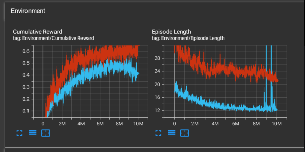
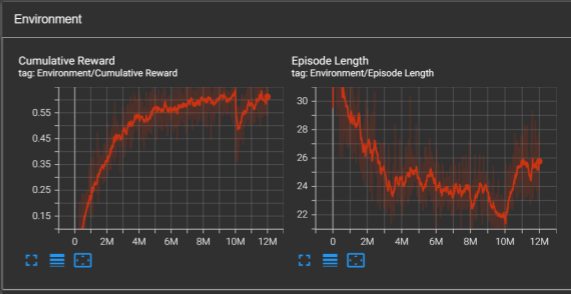

# HockAI Impact

### Teamleden
- Nicolai de Groot
- Nick Vanreusel
- Grim Van Daele
- Joshua Hall

## Inleiding

We willen een nostalgische air hockey-ervaring bieden, maar dan thuis. We kozen voor een Ai omdat dit een meer natuurlijk en menselijk gevoel te geven aan het spel. Hierdoor vermijden we dat je het gevoel krijgt dat je tegen een computer aan het spelen bent. Het VR aspect geeft meer vrijheid, inlevingsvermogen en zonder zich zorgen te maken over fysieke locaties. Dit maakt het gemakkelijk en leuk voor iedereen, zonder gedoe.

Air hockey wordt met 2 spelers gespeelt. Doordat wij Ai gebruiken bieden wij een single player ervaring aan. Wij kozen voor een single agent. 

Voor de installatie moet er rekening gehouden worden met volgende versie voor de applicatie:
- Unity version: 2022.3.27f1

## Functionele logica

De speler probeert met zijn striker de puck in de goal van de tegenspeler te krijgen en te vermijden dat die puck in eigen doel terecht komt om het spel te winnen.
De speler kan met de VR controllers de puck vastpakken en met een vloeiende beweging deze striker tot beweging brengen. Als de striker in contact komt met de puck, wordt die naar de kant geduwd waar de speler naar mikt met de striker.

## Draaiboek

Introductie
- Speler in VR-lobby.
- Korte uitleg spelregels.

Spelstart
- Speler en tegenstander op het speelterrein.
- Puck in het midden.
Spelverloop
- Speler gebruikt controller om striker te bewegen.
- Doel: puck in tegenstander's goal, eigen goal vermijden.

Finale
- Een speler scoort doelpunt.

## Tutorial
Je start de applicatie op. De speler zal vanaf start in een kamer bevinden op de maan waar die zicht vrij kan teleporteren in het omgeving. De speler kan zich voortbewegen tot de tutorial bord voor de uitleg van het spel en de speler kan ook bewegen tot de air hockey tafel waar de spel gestart kan worden. De speler kiest tot welke score er gespeelt wordt en kan beginnen aan het spel.

## Beschrijving van de objecten
In het virtuele omgeving zijn de belangrijkste objecten in het spel 'de striker' waarmee de speler de puck kan wegduwen, 'de puck' die naar de tegengestelde goal moet bewogen worden en 'de speeltafel'. De speeltafel bevat de trigger functies die punten weergeven indien er gescoord wordt in een goal. 

## Beschrijvingen van het gedrag van de objecten
Puck: cilinder die een rigedbody bevat
Agent striker: cilinder die een rigedbody en agent bevat
Player striker: cilinder die een rigedbody en XR  Grab interactable bevat
Tafel: waar het spel gespeelt wordt.

Puck: bevat score in welke goal het beland, speelt geluid af als de snelheid veranderd.
Agent striker: wordt bestuurd door de AI.
XR Rig: kan teleporteren, snap turnen,  en kan de striker oppakken

## Model training 
We hebben in het begin verschillende manieren geprobeert om aan model training te doen. We hebben de 'self-play' methode geprobeert waarbij 2 Ai's tegen elkaar spelen gebasseerd op dezelfde trainingsmodel. Dit resulteerde niet goed.

We hebben daarna een andere techniek geprobeert waarbij de Ai tegen een tegenstander speelt die randomised bewegingen kon uitvoeren die ook een random kracht tegen de puck uitvoert. Deze techniek hielp heel goed om tot een goede training te bekomen. 

Met deze techniek zijn er 2 verschillende soorten trainingen gebeurt. De blauwe lijnen simuleren de training die wij hebben gedaan op een klein oppervlak van tafel. De rode lijn is een training die wij hebben op een groter oppervlak van een tafel.

Als wij deze obeservaties bekijken zagen wij dat het model het beste presteerde op een groter tafel oppervlak waarbij wij uiteindelijk besloten hadden met deze model verder te gaan.

We hebben dit model dus nog extra gefinetuned op de meer realistische tafel door meer epochs te gebruiken.

Als wij de grafieken bekijken zien we dat er een stabiele leerpatroon is en dat we aan accumulated accuracy hebben van 0.60 . We vonden dit een ideale score omdat wij ook niet wouden dat het model begon te overtrainen en dat het te moeilijk wordt voor de speler om tegen de Ai te spelen.

We hebben de model getraind op 12 miljoen epochs.

### Acties en beloningen
De AI is getraint op 3 vormen van reward. 

- Als de agent de puck scoort in de goal van de tegenspeler, krijgt die een score van 1.
- Als de tegenstander de puck scoort in de goal van Ai agent dan krijgt de agent een score van -1.
- Als de agent de puck zou aanraken, zou die een reward krijgen van 0.1

### Conclusie van de training
Na een lange training waar wij op verschillende manieren hebben getraind vinden wij dat wij een goed AI model hebben gemaakt die uitdagend is voor de speler. 

## Conclusie
Wij hebben dus een Air hockey spel gemaakt in een Unity VR omgeving waar de speler in een unieke omgeving zit waar die tegen een Agent speelt om de meeste goals in het spel te maken. 

De trainingsresultaat van de agent was meer als voldoende vonden wij. Als wij het model langer hadden getraint, kon het spel voor de speler te moeilijk zijn om te spelen zijn tegen de agent.

Eventuele verbeteringen aan de toekomst zijn dat we mogelijk 3 of meerdere verschillende modellen konden verwerken in het spel waarbij elk model een keuze moeilijkheidsgraad beschrijft voor de speler zodat die een difficultie keuze kon maken hoe de speler het spel wilt spelen. Per difficultie zou er dan ook 3 verschillende locaties zijn om te spelen.

Een uitbreiding dat wij nog wouden toevoegen is dat een statistics bord komt met de wins van de speler en de wins van de agent. 

## Bronvermeldingen

- Glitch Squirrel. (2019, November 5). Lunar Landscape 3D (Version 1.1) [Unity asset]. NicoliadG(Personal). 
Retrieved from https://assetstore.unity.com/packages/3d/environments/landscapes/lunar-landscape-3d-132614.
- Stagit East. (2019, April 12). Earth & Planets skyboxes (Version 1.1) [Unity asset]. NicoliadG(Personal). Retrieved from https://assetstore.unity.com/packages/2d/textures-materials/sky/earth-planets-skyboxes-53752.
- Sami Lehtonen. (2018, January 10). sFuture Modules PRO Space and Ground (Version 1.1) [Unity asset]. NicoliadG(Personal). Retrieved from https://assetstore.unity.com/packages/3d/environments/sci-fi/sfuture-modules-pro-space-and-ground-104018.
- Geniuscrate Games. (2023, October 2). Hall Set - Interior (Version 1.0) [Unity asset]. NicoliadG(Personal). Retrieved from https://assetstore.unity.com/packages/3d/props/furniture/hall-set-interior-263077.
- OneProgram3. (2018, May 28). Small Pack Furniture (Version 1.2) [Unity asset]. NicoliadG(Personal). Retrieved from https://assetstore.unity.com/packages/3d/props/furniture/small-pack-furniture-56628.
- Azerilo. (2018, July 26). Free Rug Pack (Version 1.0) [Unity asset]. NicoliadG(Personal). Retrieved from https://assetstore.unity.com/packages/3d/props/interior/free-rug-pack-118178.
- YalcinKaragozler. (2016, July 28). Nice Materials Pack Vol. 2 (Version 1.0) [Unity asset]. NicoliadG(Personal). Retrieved from https://assetstore.unity.com/packages/2d/textures-materials/nice-materials-pack-vol-2-67599.
- OpenAI. (2024). ChatGPT (Jun 17 versie) [Large language model]. Van https://www.openai.com/chatgpt.
- Zhang, J. (2021, October 22). Competitive self-play with Unity ML-Agents. Coder One. https://www.gocoder.one/blog/competitive-self-play-unity-ml-agents/

